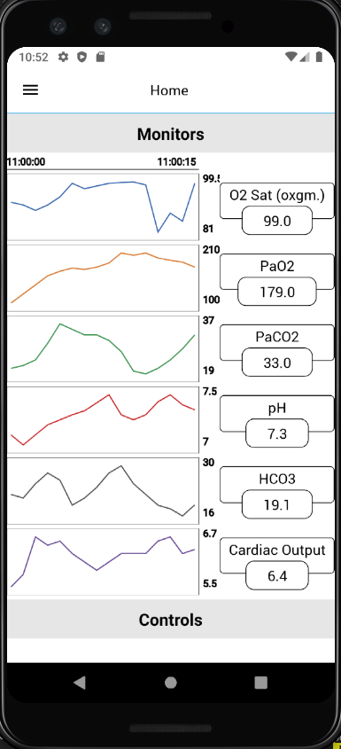

# Open Source Ventilator UI

An open source cross-platform ventilator UI using React Native and Redux.

Boilerplate taken from [daviddang91/react-native-redux-starter-kit](https://github.com/daviddang91/react-native-redux-starter-kit)

UI is based on a paper by [Tovar et al.](https://www.researchgate.net/publication/21347684_The_design_of_a_user_interface_for_a_ventilator-management_advisor)

## Motivation

With ventilators in short supply amid the COVID-19 pandemic, motivated engineers have been thinking of [alternate approaches](https://ideas.4brad.com/creating-plan-reprogram-smart-cpap-machines-become-emergency-ventilators?fbclid=IwAR32C88yPHcioXnKK3fedvi-0STfUxVVvvDmxtC0DN_pLx10hQMq96Weolc) to quickly increase supply. This project aims to make available a smart phone user interface for controlling an ad-hoc or low-cost ventilator system. I imagine that the UI will interact with the ventilator through TLS and websockets, but the code is intended to be protocol agnostic - you should be able to write an interface for the communication protocol of your choice and swap out the TLS one.

## Caveats

I have never used a ventilator and my knowledge of ventilators begins and ends with this hour-long [Med-cram course](https://www.medcram.com/courses/COVID19-ventilator-mechanical-ventilation?fbclid=IwAR1pwLeSyTTVwNo6_-d1xhMUXPavGMFaVvjm6UAuMBiM2KJm_HhCdow5p9E). I will do the best I can to make a useful product, but I am very new to this area. Please, if you happen upon this project, fork it, submit pull requests, message me - I want this to be of some use and I can't do that alone.

## Requirements

- [Node](https://nodejs.org) `6.x` or newer
- [React Native](http://facebook.github.io/react-native/docs/getting-started.html) for development
- [Xcode](https://developer.apple.com/xcode/) for iOS development
- [Android Studio](https://developer.android.com/studio/index.html) for Android development
- [Android SDK](https://developer.android.com/sdk/) `23.0.1` or newer for Android development
- [Genymotion](https://www.genymotion.com/) for Android emulation
- [Android Marshmallow](https://www.android.com/versions/marshmallow-6-0/) or newer on your Android device to test properly

See [Getting Started](https://facebook.github.io/react-native/docs/getting-started.html) to install requirement tools.

## Stack

- [React JS](https://reactjs.org/) is a JavaScript library
- [React Native](https://facebook.github.io/react-native/) `0.57.0` for building native apps using react
- [Redux](https://redux.js.org) `4.0.0` a predictable state container for Javascript apps
- [Babel](http://babeljs.io/) `7.2.3` for ES6+ support
- [NativeBase](https://nativebase.io/) `2.7.2` a UI components for React Native
- [Immutable](https://facebook.github.io/immutable-js/) Immutable persistent data collections for Javascript
- [Navigation for React Native](https://reactnavigation.org/) a router based on new React Native Navigation API


## Libraries
- [native-base](https://nativebase.io/) `2.7.2`
- [redux-modal](https://github.com/yesmeck/redux-modal) `2.0.3`
- [react-native-splash-screen](https://github.com/crazycodeboy/react-native-splash-screen) `3.1.1`
- [react-native-loading-spinner-overlay](https://github.com/joinspontaneous/react-native-loading-spinner-overlay) `0.5.2`

## Get Started

#### 1. Installation

On the command prompt run the following commands

```sh
$ git clone git@github.com:adhurjaty/ventilator-ui.git

$ cd ventilator-ui/

$ npm install
```

Link react-native-svg
```sh
$ react-native link react-native-svg
```

#### 2. Simulate for iOS

**Method One**

*	Open the project in Xcode from **ios/ReactNativeStarter.xcodeproj**.

*	Hit the play button.


**Method Two**

*	Run the following command in your terminal.

```sh
$ react-native run-ios
```

#### 3. Simulate for Android

*	Make sure you have an **Android emulator** installed and running.

*	Run the following command in your terminal.

```sh
$ react-native start
```
In another terminal, run
```sh
$ react-native run-android
```

## Project Status

### Code

This is the very beginning of the project. Pushed only the boilerplate code. I am currently only running on an Android emulator, so iOS may not work as of now

### UI Mockups

(Ignore the color scheme)




### Model Structure


